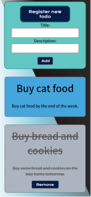
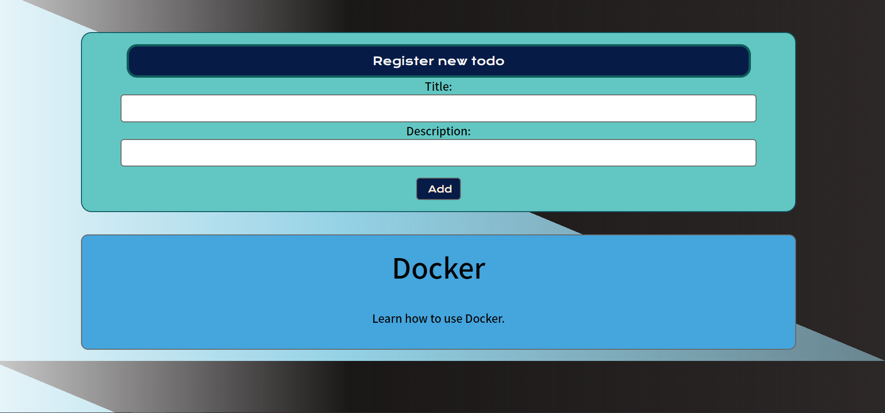

# TO-DO-LIST-JS

This is a simple TO-DO app, a frontend application created using JavaScript with mobile first approach design.

|  |
|:---:|
| Mobile version |

|  |
|:---:|
| Desktop version |

## Functionalities
* Initially, the list of todo cards is empty.
* When a new todo task is submitted from the form, a new todo card apears on the board.
* When clicking on a todo card the card visuallyis mark as done. Clicking it again will toggle the card back to its original appearance. 
*  Once a task is marked as done a remove-button will show up, so the task can be removed. When the button is clicked, the card will be removed from the board.
* The cards marked as 'done' are moved to the bottom of the list.

## How to use it 
- **Clone the repo: git@github.com:Danijela2019/to-do-list-js.git**
- **Install packages: npm install**
- **Run this command in your terminal 'npm run dev'**
- **Open your browser at:http://localhost:8080**
- **Proview available on Glitch [here](https://todo-javascript.glitch.me/) P.S.It takes approximately 1min for the app to start, please be patient**

